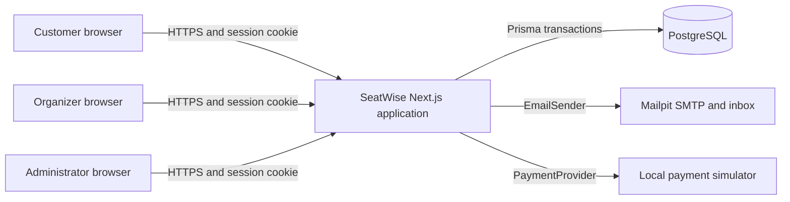
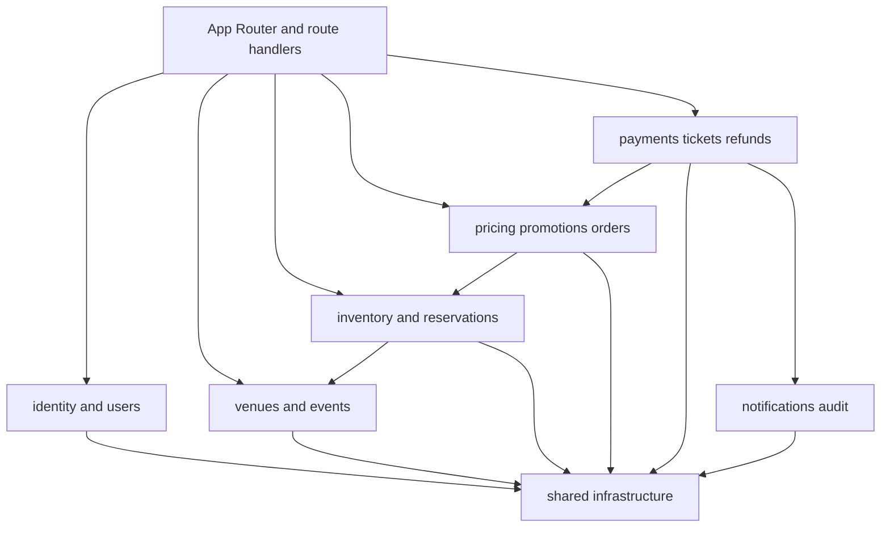
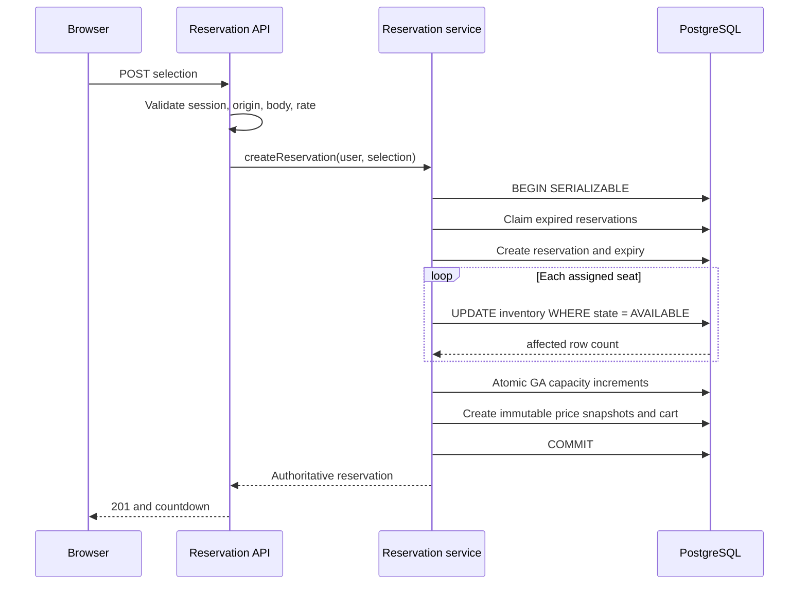
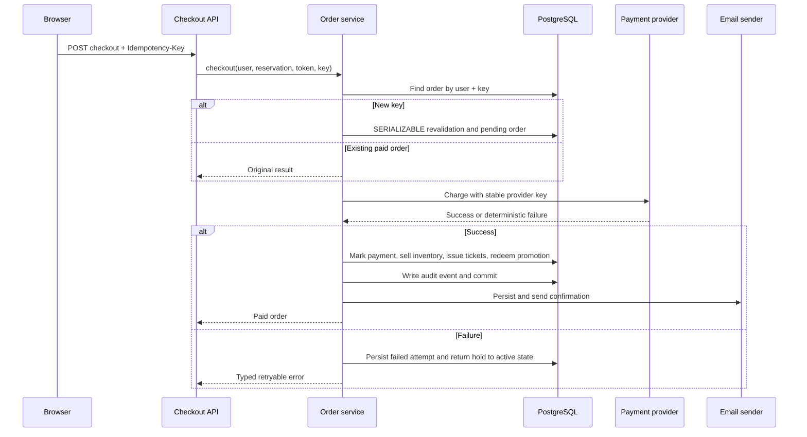

# Architecture

SeatWise is a modular monolith. One deployable Next.js application owns the
HTTP boundary, server-rendered UI, application services, and persistence
adapters. PostgreSQL is the transactional source of truth. Mailpit and the
payment simulator are replaceable local adapters.

## System context

## Module dependencies

Route handlers contain no pricing, inventory, or authorization policy. They
authenticate, validate with Zod, apply endpoint-level rate limits, call one
application service, and return the common JSON envelope.

## Seat reservation flow

An assigned seat is acquired only by a conditional database update. If two
transactions select the same inventory row, only one update can affect it; the
other transaction rolls back. General-admission acquisition uses an arithmetic
`UPDATE` whose predicate requires remaining capacity.

Expired active reservations are atomically claimed before their inventory is
released. The claim prevents two application instances from decrementing the
same general-admission hold twice.

## Checkout flow

The unique `(userId, idempotencyKey)` order constraint and unique provider
attempt key prevent duplicate orders and charges. Browser totals, roles, user
IDs, and inventory state are not accepted as checkout inputs.

## Persistence

The Prisma schema uses normalized entities for identities, organizer profiles,
venues, sections, rows, seats, events, performances, ticket types, assigned and
general-admission inventory, reservations, carts, promotions, orders, payment
attempts, tickets, refunds, notifications, and audit events.

Checked-in SQL migrations add constraints that Prisma cannot express,
including:

- internally consistent assigned-seat inventory state
- nonnegative and arithmetically consistent order totals
- GA reserved plus sold counts within capacity
- valid sales, promotion, and schedule windows
- positive quantities, attempt numbers, and refund amounts

All stored instants are PostgreSQL timestamps and are treated as UTC.
Formatting happens at UI and email boundaries.
